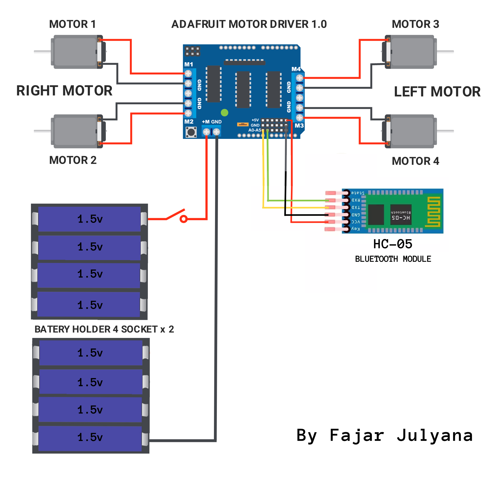

# Proyek Kontrol Motor Arduino

Proyek ini menggambarkan pengendalian motor menggunakan papan Arduino dan modul Bluetooth. Program ini memungkinkan Anda mengontrol pergerakan motor DC dengan menggunakan perintah yang diterima melalui Bluetooth.

## Memulai

### Persyaratan

Untuk menjalankan proyek ini, Anda akan memerlukan hal-hal berikut:

- Papan Arduino (misalnya, Arduino Uno)
- Modul Bluetooth
- Motor DC (4 dalam contoh ini)
- Motor driver (misalnya, Adafruit Motor Shield)
- Arduino IDE (atau perangkat lunak yang kompatibel)
- Kabel jumper

### Instalasi
## Pengkabelan

Berikut adalah pengkabelan yang diperlukan untuk proyek ini:

| Arduino Pin | Motor Driver Pin | Keterangan                    |
|-------------|-----------------|-------------------------------|
| A0          | RX (Bluetooth)  | Pin penerimaan data Bluetooth |
| A1          | TX (Bluetooth)  | Pin pengiriman data Bluetooth |
| 1           | -               | Koneksi motor Kiri Atas       |
| 2           | -               | Koneksi motor Kiri Bawah      |
| 3           | -               | Koneksi motor Kanan Bawah     |
| 4           | -               | Koneksi motor Kanan Atas      |

Pastikan untuk menghubungkan pin dengan benar sesuai dengan motor driver dan modul Bluetooth yang Anda gunakan.
### Kode
https://github.com/fajarjulyana/motor-control-with-remote-control-bluetooth-arduino-uno/blob/0cc3b96e47e5851f5958d96509e73554860bb15d/code/code.cpp#L5-L103

1. Hubungkan modul Bluetooth ke Pin Analog Arduino.
2. Hubungkan motor DC ke motor driver.
3. Hubungkan motor driver ke papan Arduino.
4. Buka Arduino IDE dan unggah sketch yang disediakan (`sketch.ino`) ke papan Arduino.
5. Pastikan untuk mengatur baud rate yang benar dalam sketch berdasarkan spesifikasi modul Bluetooth Anda.

### Penggunaan

1. Nyalakan papan Arduino.
2. Pasangkan perangkat Bluetooth Anda dengan modul Bluetooth.
3. Buka program komunikasi serial di perangkat Anda (misalnya, Serial Monitor di Arduino IDE) dan hubungkan ke modul Bluetooth dengan menggunakan baud rate yang benar.
4. Kirim perintah berikut untuk mengontrol motor:
   - 'F': Maju semua motor
   - 'B': Mundur semua motor
   - 'L': Belok kiri
   - 'R': Belok kanan
5. Sesuaikan kecepatan motor dengan memodifikasi variabel `Aturkecepatan` dalam sketch.

## Kontribusi

Kontribusi untuk proyek ini sangat diterima. Anda dapat berkontribusi dengan mengikuti langkah-langkah berikut:

1. Fork repositori.
2. Buat branch baru untuk fitur atau perbaikan bug Anda.
3. Lakukan perubahan yang diperlukan di branch Anda.
4. Ajukan pull request, jelaskan perubahan Anda dan manfaat yang diberikan.

## Lisensi

Proyek ini dilisensikan di bawah [MIT License](LICENSE).

## Dokumentasi
